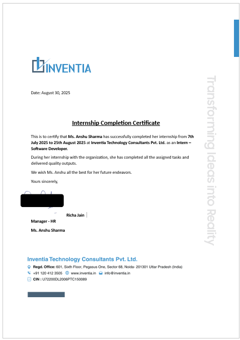

# 🌟 Internship Report – INVETIA 🌟

### Candidate: **Anshu Sharma**  
### Mentor: **Depanshu Lodhi**  
### Duration: **92 Days (July 7 – September 4, 2025)**  
### Company: **INVETIA**  

---

## 🎯 Project: Energy Consumption Forecasting

The project objective was to **develop a machine learning pipeline** for predicting *kWh energy usage* for individual accounts on specific dates, using both **historical consumption data** and **external weather data**.

---

## 📊 Work Completed
- 🔍 **Data Exploration, EDA & Visualization**  
- ⚙️ **Feature Engineering** (time-based, lag, rolling, interaction, temperature features)  
- 🤖 **Model Development** (Random Forest, XGBoost → evaluated with RMSE)  
- 🚀 **Deployment** using **FastAPI** for inference  
- 🧪 **API Testing** with Postman  
- 🗂️ **Preprocessing Module** (`preprocess.py`) for training & inference consistency  
- 📅 **Simplified Input** → *Account No + Date only* required for predictions  

---

## 🛠️ Technologies & Tools

  

---

## 📈 Learning Outcomes
- Practical **time-series forecasting** skills  
- End-to-end **ML pipeline development & deployment**  
- **Reusable preprocessing pipelines** for data consistency  
- Hands-on with **API development & testing**  

---

## 🔮 Future Work
- Implement **Deep Learning** (LSTM, Transformers)  
- Add **real-time weather API integration**  
- Build a **dashboard** for monitoring & visualization  

---

## 📜 Internship Certificate

  

---

✨ *This internship has been an incredible journey of growth, learning, and professional development.* ✨  

 

---

## 👨‍💻 Author
**Anshu Sharma**  
B.Tech (CSE - AI/ML)  
📧 [your.email@example.com] | 🌐 [LinkedIn Profile](your-linkedin) | 💻 [Portfolio](your-portfolio-link)
